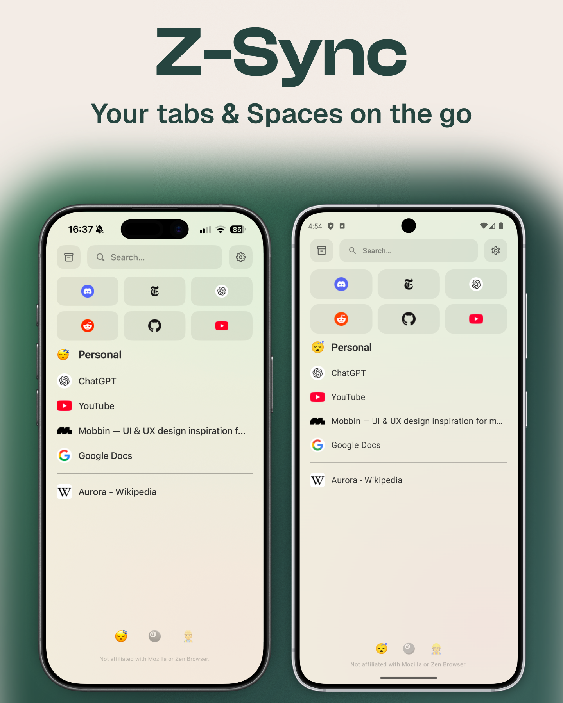
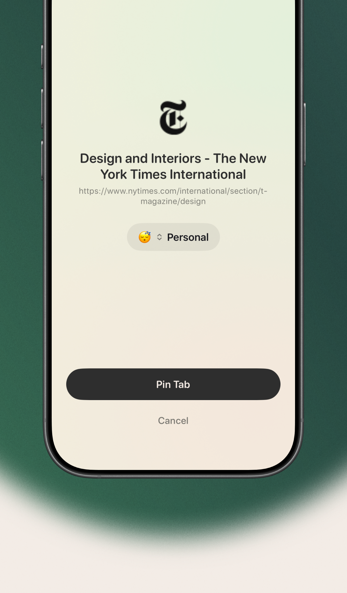
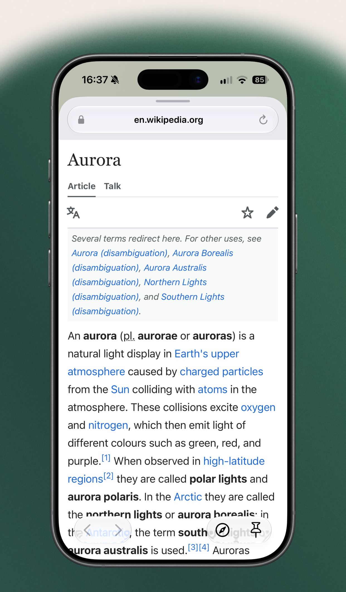

# Z-Sync

> Z-Sync is not affiliated with, endorsed by, or an official product of Zen Browser.

  
  

Z-Sync is a native iOS and Android app. It syncs your spaces, tabs, and essentials with Zen Browser over Firefox Sync.

## Share into a space

Share a link from another app and save it into a space as a pinned tab or a normal tab.

## Quick browser

Look something up in a small in-app browser without leaving Z-Sync.

## Repo

| Path | What |
| --- | --- |
| `ios/` | SwiftUI app (`ios/project.yml` → XcodeGen) |
| `android/` | Kotlin + Jetpack Compose |
| `shared/contract/` | Sync spec and golden JSON, no executable code |
| `store-listings/` | App Store and Play screenshots |

Maintained by one person.

## Contributing

See [CONTRIBUTING.md](CONTRIBUTING.md).

## Support

Z-Sync is free and ad-free. If you'd like to say thanks:

- [GitHub Sponsors](https://github.com/sponsors/Kjell6)
- [Buy Me a Coffee](https://buymeacoffee.com/kjell6)

## License

Copyright (c) 2026 Kjell Behrends. [MIT License](LICENSE).

Icons from Zen Browser are [MPL 2.0](https://www.mozilla.org/MPL/2.0/).

[Privacy](docs/privacy.md)
